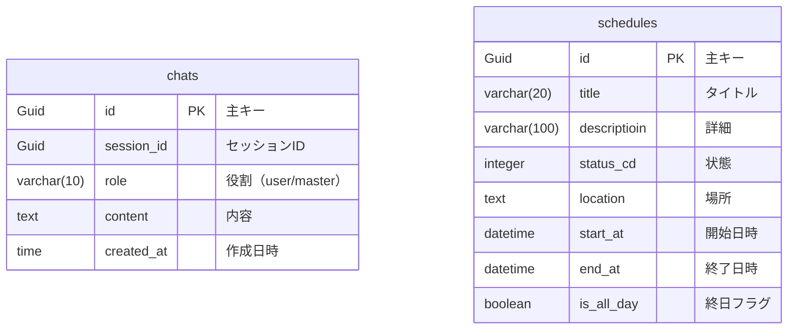

# ER図

```mermaid
erDiagram
  chats {
    Guid id PK "主キー"
    Guid session_id  "セッションID"
    varchar(10) role "役割（user/master）"
    text content "内容"
    time created_at "作成日時"
  }
  schedules {
    Guid id PK "主キー"
    varchar(20) title "タイトル"
    varchar(100) descriptioin "詳細"
    integer status_cd "状態"
    text location "場所"
    datetime start_at   "開始日時"
    datetime end_at "終了日時"
    boolean is_all_day "終日フラグ"
  }
```