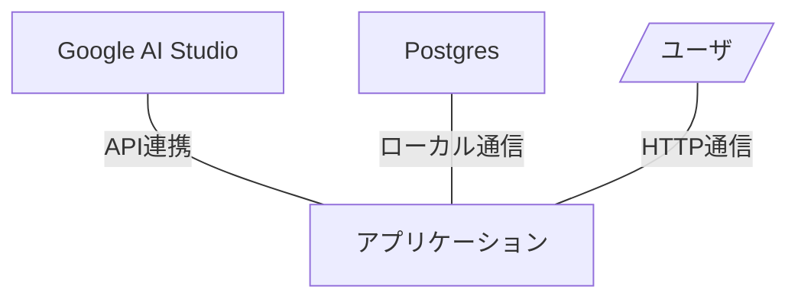

# AiAgentClient
AIモデル活用アプリケーション

## 技術選定
- Git/GitHub
- Python
- Postgres
- Oracle Cloud
- Google Gemini API

## システム関連図

```mermaid
flowchart TB
  node_1["Google AI Studio"]
  node_2["アプリケーション"]
  node_3[/"ユーザ"/]
  node_4["Postgres"]
  node_1 --"API連携"--- node_2
  node_4 --"ローカル通信"--- node_2
  node_3 --"HTTP通信"--- node_2
```