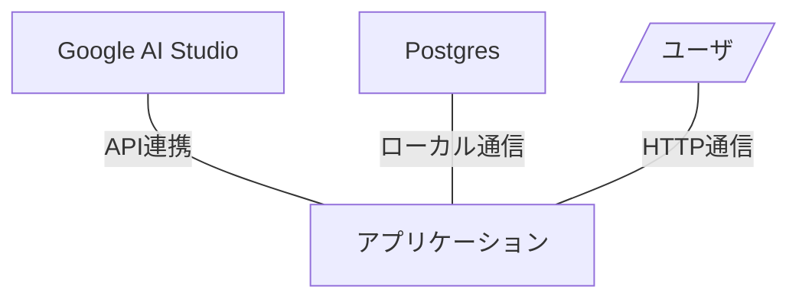

# AiAgentClient
[](https://github.com/Kita12123/AiAgentClient/actions/workflows/python-tests.yml)
AIモデル活用アプリケーション

## CI

このリポジトリは GitHub Actions によるユニットテストを実行します（push / pull_request）。

ワークフロー: .github/workflows/python-tests.yml

ローカルでテストを実行するには:

```shell
python -m unittest discover -s tests -p "test_*.py" -v
```

## 技術選定
- Git/GitHub
- Python 3.14 (uv)
- Postgres 17
- Oracle Cloud
- Google Gemini API

## システム関連図


## 開発環境構築

### Pythonセットアップ

１．uvダウンロード

参考 [GitHubリポジトリ](https://github.com/astral-sh/uv)

２．pythonセットアップ

```shell
# 最新化
uv self update
# 同期
uv sync
```

## 実行

```shell
uv run src/main.py
```